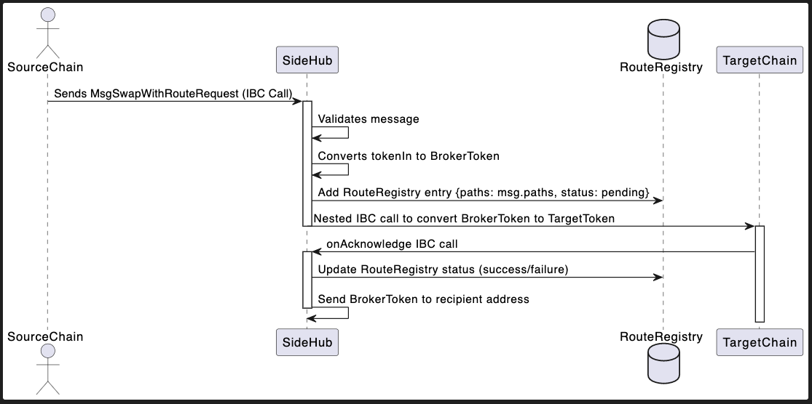

---
x/router:
title: Router
stage: draft
category: SIDEHUB/X
kind: routing
author: Marian <marian@side.one>
created: 2022-05-23
modified: 2023-05-23
---

## Synopsis

This standard document specifies sidehub route module.

## Motivation

The route mechanism has been conceptualized to address specific challenges within decentralized finance (DeFi) and interoperability. Its design incorporates two main principles:

- Flexibility of Token Exchange: The mechanism allows for a versatile exchange of any tokens through the SideHub. This design ensures that users can freely convert their assets between different tokens without worrying about the compatibility or transferability across multiple blockchain networks.

- Optimized Liquidity Utilization: One of the significant constraints in token exchange is the availability of liquidity. The route mechanism aims to circumvent this problem by effectively using SideHub as an intermediary. It leverages two types of liquidity pools in SideHub, offering users an alternative path for conversion in situations where direct liquidity between $B and $A might be limited or non-existent.

By creating a flexible route for token conversion, users can make more efficient and effective trades, contributing to the overall liquidity and robustness of the decentralized finance ecosystem. The mechanism also helps alleviate the 'slippage' problem often encountered in liquidity pools, wherein large trades significantly shift the price of a token.

This route mechanism, with its capability of nesting IBC calls within a single user transaction, makes it a unique solution within the Cosmos SDK, offering optimized transaction paths while minimizing transaction costs and maximizing transaction success rates.

Through this route mechanism, SideHub aims to play a crucial role in enhancing the interoperability of the Cosmos blockchain network, opening up numerous possibilities for token swaps and liquidity provision. It will be a significant step towards a more integrated and fluid decentralized financial landscape.

### Definitions

`SwapProgress`: Represents the status of a user's swap transaction in the DeFi ecosystem. This status could be 'pending', 'completed', 'failed', etc. It provides transparency and helps users understand the state of their transactions within a DeFi application.

`Nested IBC Call`: A concept where an Inter-Blockchain Communication (IBC) protocol call is made within the context of another IBC call. This is especially useful in DeFi applications where operations might involve multiple chains. For instance, a user could want to swap a token on chain A for a token on chain C, but the swap might need to go through chain B first.

`Broker Token`: This concept represents an intermediate token used for bridging transactions between multiple tokens or chains. For example, if you want to trade token $A for token $B, but there isn't a direct market, a broker token $C could be used to facilitate this trade ($A->$C, then $C->$B). This is especially prevalent in DeFi applications where liquidity might not be directly available between two tokens, and an intermediary (broker) token is used instead.

### Desired Properties

- Efficiency: The routing module should allow for swift and cost-effective token swaps.

- Reliability: The mechanism should provide a reliable pathway for token conversion, with minimized risk of transaction failures.

- Flexibility: The routing module should support a wide range of tokens and facilitate seamless exchange between them.

- Optimized Liquidity Utilization: The routing module should effectively utilize the liquidity pools in SideHub to ensure successful token conversions.

- Transparency: The mechanism should provide users with clear information about the status of their transactions.

## Technical Specification

### General Design

The Router module will receive data from the Inter-Blockchain Communication (IBC) module. If a direct pool for the asset pair requested by the user doesn't exist, the module will find an alternate path through an intermediary token.

For instance, if a user wishes to swap TokenX for TokenY, but no direct pool exists, the module will suggest an alternate path such as TokenX -> TokenZ -> TokenY. The final result is subject to a slippage check.

To enable this, we'll have a Middleware module that constructs a graph representing token connections. This graph will be represented as a map data structure where each key-value pair signifies a token and its directly connected tokens respectively.

Upon receiving a token pair, the system will first determine if a direct swap is possible. If not, the module will use the constructed graph to find possible paths. To avoid computational overhead, we only consider paths that involve a single intermediary token. While it's technically feasible to find the complete path using Dijkstra's algorithm, it could lead to multiple nested IBC calls which add unnecessary overhead. Hence, we limit the design to a single intermediary token.

The intersection of two array lists from the graph representing the connections of the two tokens gives us all possible paths. The list is then sorted based on the path with the lowest fees, and the swap is attempted over the two pools.

The system will first estimate how much of the intermediary token can be obtained from TokenX. It then triggers an IBC swap with a special memo (swapID). In the AcknowledgeStep, if a nested IBC swap is received, the result is returned through the OnReceive function to the counter party chain.

This operation will be executed as a goroutine. To prevent an infinite loop scenario in case the acknowledgement isn't received, we'll introduce a time limit, after which the routine will be forcibly closed. If the function enters an infinite loop, the OnReceive function will not return a value, triggering a timeout for the initial IBC call group. In the IBC swap module, when such a situation occurs, we will also forcibly timeout the nested IBC call.

To implement this, we need to update Ibc-swap module.



### Algorithms

The routing module will utilize several algorithms to manage the token swap process:

- Transaction Routing Algorithm: This algorithm will manage the routing of transactions between different chains and liquidity pools.

- Transaction Status Update Algorithm: This algorithm will update the SwapProgress status of transactions based on their progress.

- Failed Transaction Handling Algorithm: This algorithm will manage failed transactions, including retrying them if possible and necessary.

#### Transaction Routing Algorithm

This part will be implement in offchain side. Based on pool information, we can suggest most effect swap pool to users.
first of all, algorithm has to find a pool which can get maximum amount of token which exist in side hub and also is possible to exchange source chain token.
Maybe there are various path and pools, but final target is to get maximum amount target token.

There are module which can estimate swap amount, so it's possible but it's require massive loops so we will treat this in offchain.

chain only provide all possible pools.

#### Transaction Status Update Algorithm

#### Data packets

Only one packet data type is required: `IBCSwapDataPacket`, which specifies the message type and data(protobuf marshalled). It is a wrapper for interchain swap messages.

```ts
// IBCSwapDataPacket is used to wrap message for relayer.
interface SideSwapDataPacket {
    data: []byte, // Bytes
}
```

### Sub-protocols

Interchain Swap implements the following sub-protocols:

```protobuf
  rpc SideSwap(MsgSideSwapRequest) returns (MsgSideSwapResponse);
```

#### Interfaces for sub-protocols

```ts
enum SwapProgress {
  pending
  success
  fail
}
enum MessageType {
  SideSwap,
}

interface Coin {
  denom: string;
  amount: int64;
  decimal: int32;
}

interface MsgSwapWithRouterRequest {
  sourcePort: string;
  sourceChannel: string;
  sender: string;
  recipientInRoute: string;
  recipientInTarget: string;
  tokenIn: Coin;
  outDenom: string;
  sequence: number;
  slippage: int32;
  path: string[];
}

interface RouteRegistry {
  path:string[]
  status: SwapProgress
}
```

### Control Flow And Life Scope

These are methods that output a state change on the sidehub, which will be subsequently synced to the destination chain.

this part can be added to ics 101. in this case, other chains only need to integrate ics101 to use router, don't need to integrate this module directly

```ts

function SwapWithRouter(msg MsgSwapWithRouterRequest) {
    abortTransactionUnless(msg.sender != null)
    abortTransactionUnless(msg.tokenIn != null && msg.tokenIn.amount > 0)
    abortTransactionUnless(msg.tokenOut != null && msg.tokenOut.amount > 0)
    abortTransactionUnless(msg.slippage > 0)
    abortTransactionUnless(msg.recipientInRouter != null)
     abortTransactionUnless(msg.recipientInTarget != null)


    // swap source chain token to side chain token.

    const pool = store.interchainswapKeeper.findPoolById(msg.path[0])
    abortTransactionUnless(pool != null)
    abortTransactionUnless(pool.status == PoolStatus.POOL_STATUS_READY)

    // lock swap-in token to the swap module
    const escrowAddr = escrowAddress(pool.counterpartyPort, pool.counterpartyChannel)
    bank.sendCoins(msg.sender, escrowAddr, msg.tokenIn.denom)

    const amm = new InterchainMarketMaker(pool, params.getPoolFeeRate())
    const outToken = amm.leftSwap(msg.tokenIn, msg.tokenOut)
    // TODO add slippage check here.

    // update local pool state,
    const assetIn = pool.findAssetByDenom(msg.tokenIn.denom)
    assetIn.balance.amount += msg.tokenIn.amount
    const assetOut = pool.findAssetByDenom(msg.tokenOut.denom)
    assetOut.balance.amount -= outToken.amount
    store.savePool(pool)

    // contructs the IBC data packet
    const packet = {
        type: MessageType.SideSwap,
        data: protobuf.encode(msg), // encode the request message to protobuf bytes.
    }

    sendSideIBCSwapDataPacket(packet, msg.sourcePort, msg.sourceChannel, msg.timeoutHeight, msg.timeoutTimestamp)
}
```

```ts

function swap(poolId:string, tokenIn:Coin) MsgSwapResponse {

    abortTransactionUnless(msg.sender != null)
    abortTransactionUnless(msg.tokenIn != null && msg.tokenIn.amount > 0)
    abortTransactionUnless(msg.tokenOut != null && msg.tokenOut.amount > 0)
    abortTransactionUnless(msg.slippage > 0)
    abortTransactionUnless(msg.recipient != null)

    const pool = store.interchainswapKeeper.findPoolById(generatePoolId(path[0]))
    abortTransactionUnless(firstPool != null)
    // fetch fee rate from the params module, maintained by goverance
    const feeRate = pool.FeeRate
    const amm = new interchainswapTypes.InterchainMarketMaker(pool, feeRate)

    const outToken = amm.leftSwap(msg.tokenIn)
    return outToken
}

function onReceivedSwapWithRouter(msg: MsgSwapWithRouterRequest) MsgSwapResponse {

    abortTransactionUnless(msg.sender != null)
    abortTransactionUnless(msg.tokenIn != null && msg.tokenIn.amount > 0)
    abortTransactionUnless(msg.tokenOut != null && msg.tokenOut.amount > 0)
    abortTransactionUnless(msg.slippage > 0)
    abortTransactionUnless(msg.recipient != null)

    const sideToken = swap(path[0],msg.TokenIn)
    abortTransactionUnless(sideToken.amount != 0)
    abortTransactionUnless(bank.includeDenom(sideToken.denom))

    const targetToken = swap(path[1],sideToken)
    abortTransactionUnless(sideToken.amount >= sideToken.amount*(10000-msg.slippage)/10000)

    //store.interchainswapKeeper.onReceived()
    const swapID = getID(msg.sender, msg.sequence)
    const swapMsg: MsgSwapRequest =   {
        sender: msg.sender,
        swapId: swapID,
        swapType: SwapType.LeftSwap,
        tokenIn: sideToken,
        tokenOut: msg.denomOut,
        slippage: msg.slippage; // max tolerated slippage
        recipient: msg.recipient,
    }
    // build interchainswap
    store.interchainswapKeeper.leftSwap(swapMsg)
    store.setSwapProgress(swapID, {path: msg.Path, status: SwapProgress.pending})

    return { tokens: outToken }
}

function ListenInterchainSwapAcknowledgement(ack channeltypes.Acknowledgement, packet    channeltypes.Packet) {
    var ack channeltypes.Acknowledgement
    if (!ack.success()) {
        const swapPacket = protobuf.decode(packet.data)
        switch swapPacket.type {
        case SWAP:
            var msg: MsgSwapRequest = protobuf.decode(swapPacket.data)
            store.setSwapProgress(msg.SwapID, SwapProgress.fail)
            refundBrokerToken(msg.sender, msg.swapID,msg.tokenIn,recipient)
            break;
        }
    } else {
        const swapPacket = protobuf.decode(packet.data)
        switch swapPacket.type {
        case SWAP:
            var msg: MsgSwapRequest = protobuf.decode(swapPacket.data)
            store.setSwapProgress(msg.SwapID, SwapProgress.success)
            break;
        }
    }
    return nil
}

function ListenInterchainSwapTimeOut(ack,packet channeltypes.Packet) {
    const swapPacket = protobuf.decode(packet.data)
    switch swapPacket.type {
      case SWAP:
          var msg: MsgSwapRequest = protobuf.decode(swapPacket.data)
          store.setSwapProgress(msg.SwapID, SwapProgress.failed)
          refundBrokerToken(msg.sender, msg.swapID,msg.tokenIn,recipient)
          break;
      }
    return nil
}

function refundBrokerToken(sender:string,swapID: string,refundToken Coin, recipient) {
    const route = store.getRouteRegistry(sender, swapID)
    const pool = store.interchainswapKeeper.getLiquidityPool(route.path[0])
    const escrowAddr = escrowAddress(pool.counterpartyPort, pool.counterpartyChannel)
            bank.send(escrowAddr, recipient, msg.TokenIn)
    bank.send(escrowAddr, recipient, msg.TokenIn)
}
```

## Risks

- if nested ibc call might be failed, user can't get target token. instead of that, user will get broker token.
