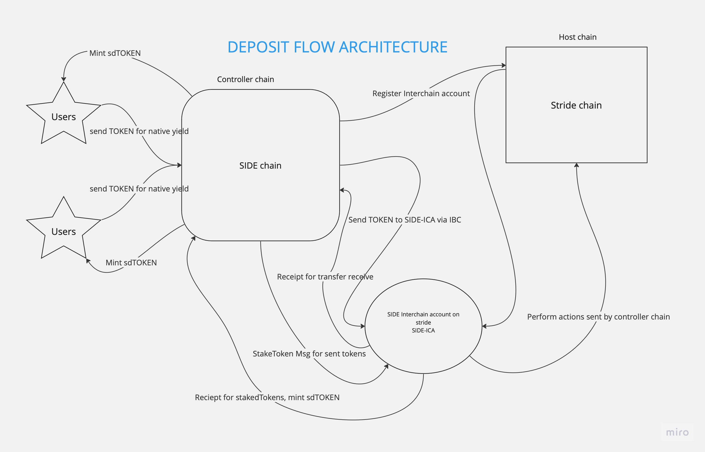
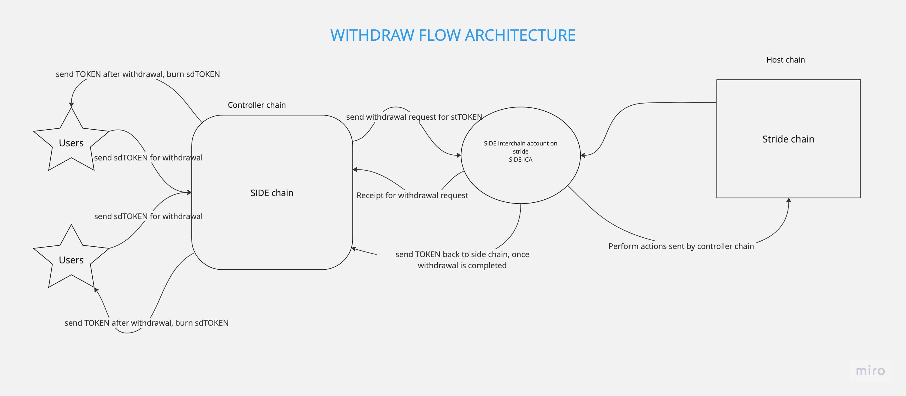

# Aggregate native yields specification

## Motivation

Enable users to earn native yield on cosmos tokens on SIDE chain via ICS20, using Stride for liquid staking, and then issue a representation of these staked assets as sdTOKEN tokens on the SIDE chain. sdTOKEN can be further used in other use cases.

## ICA (ICS-27)

ICS-27 Interchain Accounts outlines a cross-chain account management protocol built upon IBC. ICS-27 enabled chains can programmatically create accounts on other ICS-27 enabled chains & control these accounts via IBC transactions (instead of signing with a private key). Interchain accounts retain all of the capabilities of a normal account (i.e. stake, send, vote) but instead are managed by a separate chain via IBC in a way such that the owner account on the controller chain retains full control over any interchain account(s) it registers on host chain(s).

## Definitions

- `Host Chain`: The chain where the interchain account is registered. The host chain listens for IBC packets from a controller chain which contain instructions (e.g. cosmos SDK messages) that the interchain account will execute.
- `Controller Chain`: The chain registering and controlling an account on a host chain. The controller chain sends IBC packets to the host chain to control the account.
- `Interchain Account(ICA)`: An account on a host chain. An interchain account has all the capabilities of a normal account. However, rather than signing transactions with a private key, a controller chain will send IBC packets to the host chain which signals what transactions the interchain account must execute.
- `Interchain Account Owner`: An account on the controller chain. Every interchain account on a host chain has a respective owner account on the controller chain.

## Primary Actors

- Users
- SIDE chain: Enable users to earn native yields.
- Stride platform: Provide staking for tokens.

## Architecture

1. Deposit flow

`Note: If TOKEN is from chain X, SIDE chain first transfers it to chain X first and then to stride`

2. Withdraw flow

`Note: If TOKEN is from chain X, SIDE chain first transfers it to chain X first and then to side chain`

## Detailed Specification

1. User Deposit Process

- `User Action`: Users send TOKEN from an IBC-enabled chain to the SIDE chain.
- `IBC Protocol (ICS20)`: Facilitates the cross-chain transfer of TOKEN.

2. Middleware Processing

- `Middleware Role`: Intercepts incoming IBC messages and filters them for specific criteria (e.g., native yield, no yield etc).
- `Transfer to Stride`: The middleware forwards the filtered TOKEN to the Stride platform for liquid staking. For example: If ATOM is sent, first ATOM will be sent to cosmos hub and then to stride.

3. Liquid Staking with Stride

- `Staking Transaction`: Stride receives TOKEN and SIDE calls stake message to stake them.
- `stATOM Generation`: Stride issues stTOKEN tokens, representing the staked TOKEN assets.

4. Receiving stATOM and Issuing sdATOM

- `Receipt on SIDE Chain:` The SIDE chain account receives stTOKEN tokens in a designated account(SIDE-ICA).
- `sdTOKEN Issuance`: Corresponding sdTOKEN tokens are issued to the users on the SIDE chain, representing their staked assets using `mint` module.

5. Utilizing Interchain Accounts (ICA)

### Role of Interchain Accounts (ICA)

- `Definition`: Interchain Accounts (ICA) is a protocol within the IBC ecosystem that allows a blockchain (the controller chain) to operate an account on another blockchain (the host chain).
- `Controller Chain`: In this scenario, the SIDE chain acts as the controller chain. It has the authority to initiate actions on the Stride chain through the ICA protocol.
- `Host Chain`: The Stride chain serves as the host chain. It holds the accounts that are controlled by the SIDE chain through ICA.

### ICA Operations in Liquid Staking

- `Account Management`: The SIDE chain, via ICA, manages specific accounts on the Stride chain. These accounts are used for staking operations.
- `Staking Transactions`: When a user deposits ATOM tokens to the SIDE chain for liquid staking, the SIDE chain initiates a StakeAtom message through its ICA on the Stride chain. This message triggers the staking of ATOM tokens on the Stride chain.
- `Receipt of stATOM`: Once staking is confirmed on the Stride chain, stATOM tokens are issued to the SIDE chain's account on the Stride chain.
- `StakeAtom Message`: An ICA transaction is sent from the SIDE chain to the Stride chain to initiate the staking of ATOM tokens.

6. Epoch Module

- `Purpose`: Manages and triggers epoch-based events in the staking process.
- `Functionality`: Could include handling rewards, rebalancing staked assets, or triggering specific contract actions based on time or other conditions.

## Implementation details

