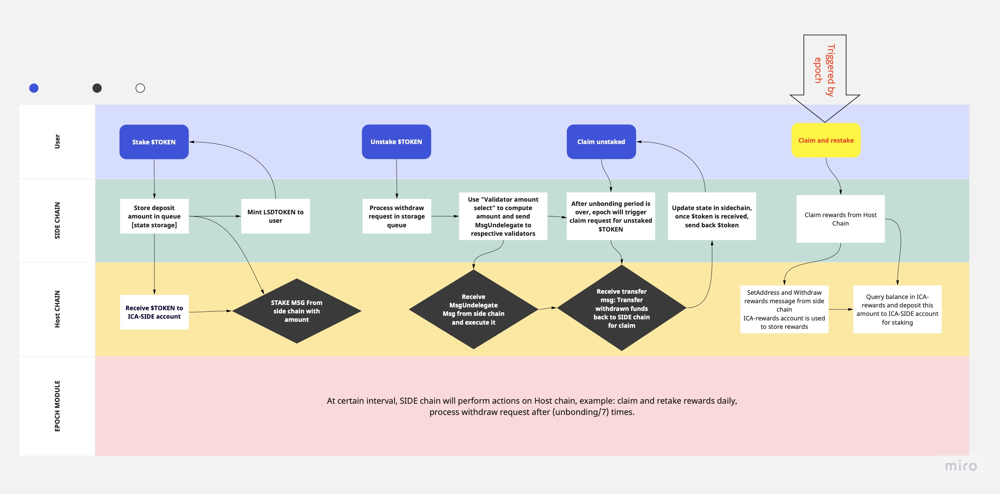

# Liquid Staking Derivative Specification

## Introduction

The Liquid Staking Derivative aims to provide users with the ability to stake assets while maintaining liquidity through the issuance of derivative tokens. This specification outlines the technical details and features implemented using the Cosmos SDK.

## Architecture

The architecture comprises ICA, ICQ modules, minting module, allowing users to stake assets and receive derivative tokens representing their staked holdings.

## Core features

### Liquid Staking
- Users can stake assets to receive derivative tokens.
- Minting and burning of derivative tokens based on staking and unstaking actions.
- Users can then use derivatives tokens in DeFi

### Staking Rewards
- Calculation and distribution of staking rewards.
- Users rewards are accumulated in derivative tokens i.e value of derivative token increases over time.